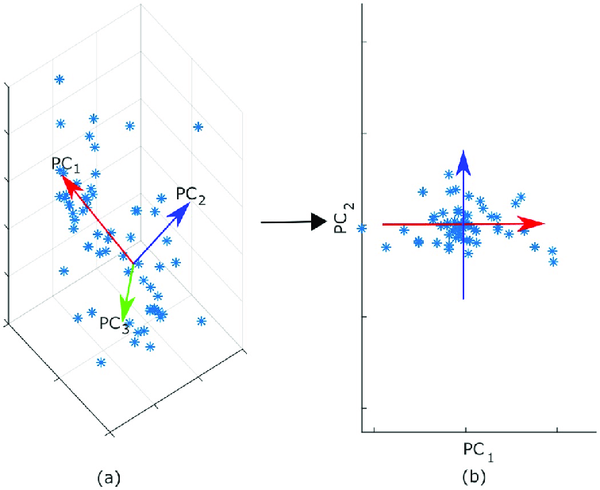

# PCA (Principle Component Analysis) - 주성분분석

앞서 LDA에서는 데이터의 그룹이 명확하게 구분지어질 수 있는 사영 직선을 찾는 것이 목표였다. 따라서, 데이터의 명확한 구획화를 위해 데이터 개별 데이터 그룹의 분산 합은 최소가 되고, 동시에 그룹 평균의 거리는 최대가 되도록 하는 직선으로 사영시키는 사영 행렬을 찾았다.

PCA 역시 데이터를 재조정하기 위해 특정 공간으로 사영시킨다는 점에서 LDA와 유사하다. 다만, PCA의 경우 계산의 용이함을 위해 차원을 줄이는 과정에서, 정보의 손실이 최소가 되도록 하는 사영 벡터를 찾는 것이 목표이다. 즉, 이름 그대로 데이터의 특성이 잘 반영된 저차원의 공간으로 사영한다는 것이다.

다만, PCA에서는 제약 함수가 추가된다. 특정 범위 내부에서 원본 차원 공간의 특성을 잘 유지하도록 저차원으로 사영되게 하는 사영 행렬을 찾는 것이 PCA의 목표라고 할 수 있다.

## 목적함수 정의

PCA에서는 $\mathbb u$가 단위벡터여야 한다는 조건함수도 적용된다. 조건함수를 고려하면서 최적값을 계산하는 방법론으로는 **라그랑주 승수법 (Lagrange Multiplier)** 이 있다. 지금부터는 최적값 함수부터 라그랑주 승수법을 사용하여 제약 함수를 적용하는 방법을 단계별로 안내하겠다. 

> **1. 최적값을 구하는 함수 $f(\mathbb X)$ 정의** 

PCA에서는 최대한 원본 차원의 데이터의 특성을 유지시켜야 한다. 2차원 데이터를 1차원 선상으로 사영시킨다고 생각해보자. 어떻게 2차원 벡터를 사영시켜야 가장 원래 데이터의 특성을 잘 반영할 수 있을까? 

방법은 바로 사영된 벡터들의 분산이 최대가 되는 공간에 사영시키는 것이다. 이를 수식으로 표현하면 아래와 같다. 사영된 벡터는 $\tilde{\mathbb X} = \mathbb u^T \mathbb X$로 표현한다. $\mathbb X$의 평균벡터는 $\bar{\mathbb X}$로 표기한다.

$$
f(\mathbb u,\mathbb X) = Var(\mathbb u^T\mathbb X) = \sum \frac{1}{N}(\mathbb u^T\mathbb X - \mathbb u^T\bar{\mathbb X})^2
$$

위 식을 좀 더 정리해서 아래의 식으로 나타낼 수 있다,
$$
f(\mathbb u,\mathbb X) = \frac{1}{N}\sum (\mathbb u^T\mathbb X - \mathbb u^T\bar{\mathbb X})^2
$$

> **2. 제약함수를 적용하기 위한 라그랑주 승수법**

PCA에서 $\mathbb u$의 제약조건은 $\mathbb u$가 단위벡터여야 한다는 것이다. $\mathbb u$는 어디까지나 사영벡터로, 사실상 $\mathbb u$가 될 수 있는 벡터는 무한하다. 제약조건을 설정하는 것은 단지 이들 중에서 가장 기본이 된다고 할 수 있는 단위 벡터만을 선별하는 과정이다. 단위벡터는 크기가 1인 벡터로, $\mathbb u$의 단위벡터에 대한 식은 아래와 같다. 

$$
\mathbb u ^T \mathbb u = 1,\mathbb u^T \mathbb u -1 = 0 
$$
$$
g(\mathbb u) = \mathbb u ^T \mathbb u -1
$$

그리고 과정 1의 $f(\mathbb u, \mathbb X)$와 과정 2의 $g(\mathbb u)$를 조합한 목적함수 $L(\mathbb u,\lambda)$는 아래와 같다.

$$
L(\mathbb u, \lambda) = f(\mathbb u,\mathbb X) - \lambda g(\mathbb u)
$$

이를 $\mathbb u, \mathbb X$에 대한 식으로 나타내면 아래와 같다.

$$
L(\mathbb u, \lambda) = \frac{1}{N}\sum(\mathbb u^T\mathbb X - \mathbb u^T\bar{\mathbb X})^2 - \lambda(\mathbb u^T\mathbb u - 1)
$$

## 수식풀이

$L(\mathbb u, \lambda)$에 대한 미분값이 0이 되는 동시에 $\mathbb u^T\mathbb u = 1$을 만족하여야 한다. 

> **1. $L$을 $\mathbb u$로 미분했을 때 0이 되는 $\mathbb u$ 구하기**

:::info 💡 벡터의 미분
> **$v^Tv$ 꼴의 미분 |** 
이 경우, 결과값은 스칼라이다. 따라서, 일반적인 변수를 미분하듯이 미분해주면 된다.
:::

$$
\frac{\partial}{\partial \mathbb u} L(\mathbb u, \lambda) = \frac{1}{N}\sum 2(\mathbb u^T\mathbb X-\mathbb u^T\bar{\mathbb X})(\mathbb X - \bar{\mathbb X}) - 2\lambda\mathbb u
$$

$$
\frac{1}{N}\sum 2(\mathbb u^T\mathbb X-\mathbb u^T\bar{\mathbb X})(\mathbb X - \bar{\mathbb X}) - 2\lambda\mathbb u = \frac{2}{N}\sum \mathbb u^T(\mathbb X - \bar{\mathbb X})(\mathbb X - \bar{\mathbb X})^T - 2\lambda\mathbb u
$$

위 식에서 공분산행렬($\mathbb\Sigma = \frac{1}{N}\sum(\mathbb X - \bar{\mathbb X})(\mathbb X - \bar{\mathbb X})^T$)이 유도되도록 수식을 정리하면 아래와 같다.

$$
2\mathbb u^T\frac{1}{N}\sum(\mathbb X - \bar{\mathbb X})(\mathbb X - \bar{\mathbb X})^T - \frac{2}{N}\sum\lambda\mathbb u = 0
$$

여기서 $\sum\lambda\mathbb u = N\lambda\mathbb u$이므로 $\frac{2}{N}\sum\lambda\mathbb u = 2\lambda\mathbb u$로 나타낼 수 있다. 위의 식을 공분산행렬이 포함된 식으로 다시 표현하여 정리하면 아래와 같다. 

$$
2\mathbb u^T \mathbb{\Sigma} - 2\lambda\mathbb u = 0
$$

공분산행렬에 대한 식으로 정리하면 아래와 같다. 공분산행렬은 D x D 정방행렬이고, $\mathbb u$는 D보다는 차원수가 작은 벡터 D`이다. (PCA는 사영 이후 차원이 줄어들기 때문이다.) 따라서 해당 등식이 성립하기 위해선 $2\mathbb u^T\mathbb{\Sigma} = 2\mathbb{\Sigma}\mathbb u$로 변환해야 한다.
$$
\mathbb{\Sigma}\mathbb u = \lambda\mathbb u
$$

뭔가 [익숙한 형태](../linear-algebra-application/intermediate-chap-1.html)이지 않은가? $\mathbb A\mathbb X = \lambda \mathbb X$는 바로 고유값 분해된 형태의 식이다. 따라서, $\mathbb u$는 D'차원의 $\mathbb X$의 고유벡터이고 $\lambda$는 고유값으로 볼 수 있다. 고유값과 고유벡터에 대한 설명은 [선형대수 - 응용 | 1. 고유값과 고유벡터](../linear-algebra-application/intermediate-chap-1.html)를 참고하면 된다.

> **2. 앞서 구한 $\mathbb u$가 단위벡터인지 확인하기**

마지막으로 구한 $\mathbb u$이 단위벡터인지 확인한다. 단위벡터에 대한 설명은 [선형대수 - 기초 | 2. 벡터, 행렬 기본개념](../linear-algebra-basic/linear-algebra-basic-chap-2.html)에 있다.

## 특징

이렇게 사영된 공간의 특성은 어떨까? 처음에 봤던 이미지처럼 타원이 아닌 거의 원형의 형태로 데이터가 흩뿌려진 형태로 사영된다. 특정 방향으로 길게 늘어난 타원 형태의 분포를 보이는 것은 차원간 종속성이 존재한다는 것을 의미한다. 즉, 타원의 형태보다 원 형태에 가까울수록 차원간 종속성이 줄어든다고 해석할 수 있다. 

앞선 수식 풀이를 통해, 결과적으로 $\mathbb u$가 고유벡터임을 확인했다. 고유벡터는 차원간 종속성이 거의 배제된, 말 그대로 원 데이터에서 종속적인 특성을 갖는 차원들에서 특징적인(고유한) 차원 벡터만을 추출한 것이다. 

그러므로 PCA는 축소하고자 하는 차원수를 갖는 고유벡터를 이용하여 데이터 차원을 저차원으로 축소하는 과정이라고도 해석할 수 있다. 

## Ref

- 이미지 출처 : Migenda, Nico & Möller, Ralf & Schenck, Wolfram. (2021). Adaptive dimensionality reduction for neural network-based online principal component analysis. PLOS ONE. 16. e0248896. 10.1371/journal.pone.0248896. 